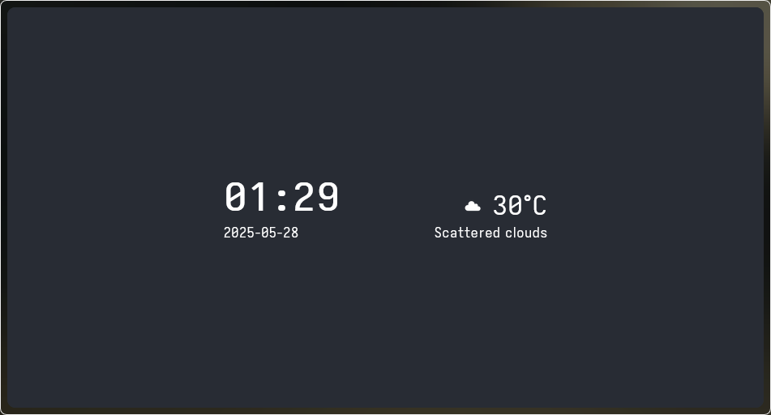

# Startpage



A simple startpage that shows the current date, time, and weather.


## Setup

1. **Copy the config file:**
   Rename the included `sample.js` to `config.js`.

2. **Get an API key:**
   Sign up at [OpenWeatherMap](https://home.openweathermap.org/api_keys) and generate an API key.

3. **Configure your location and API key:**
   Edit `config.js` and replace the placeholders:
   ```js
   const API_KEY = 'YOUR_API_KEY_HERE';
   const CITY = 'YOUR_CITY_HERE';
   ```

---

*Thanks!*

